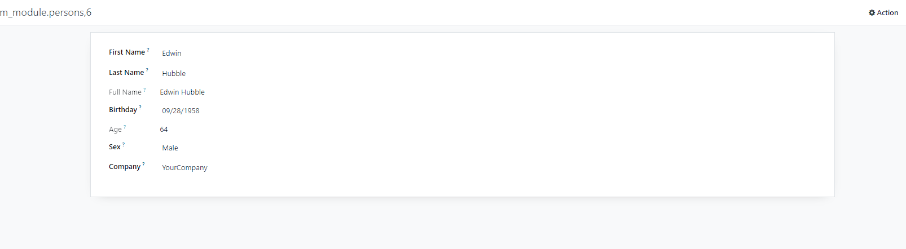

# 📑Odoo Custom Module - Persons

Simple module for management persons

## ✨Features

- Compute full name
- Calculated age of the person
- Many to one person company field

## 🌌Requirements

- Odoo 16.0

## 🔑Configuration
```shell
git clonehttps://github.com/NazarHladaniuk/odoo16.git
install odoo
python -m venv venv
venv\Scripts\activate (on Windows)
source venv/bin/activate (on macOS)
pip install -r requirements.txt
add correct data from your postgresql to odoo.conf
```

## ✒️Installation
```
1. Clone the repository or download the module.
2. Place the module in the Odoo addons directory.
3. Restart the Odoo server.
4. Log in to the Odoo instance with administrator rights.
5. Go to the Apps menu and click on the "Update Apps List" button.
6. Search for the module and click on the "Install" button.
```

## 🎨️Images

